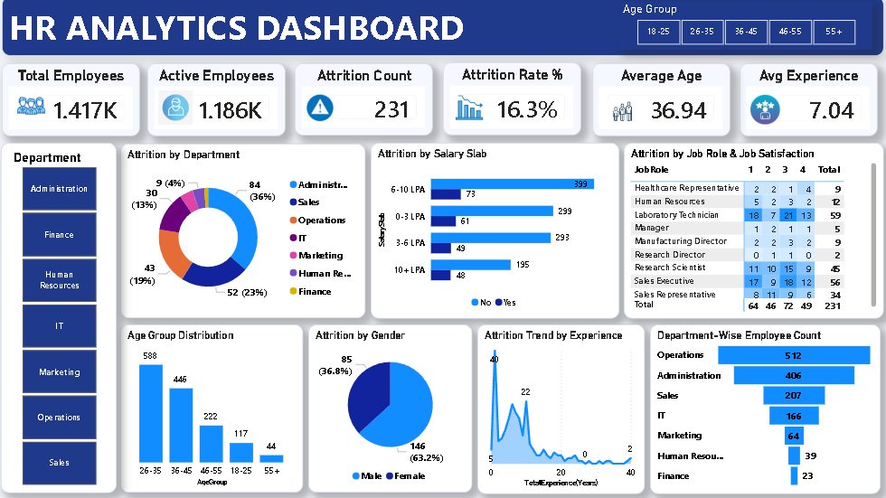
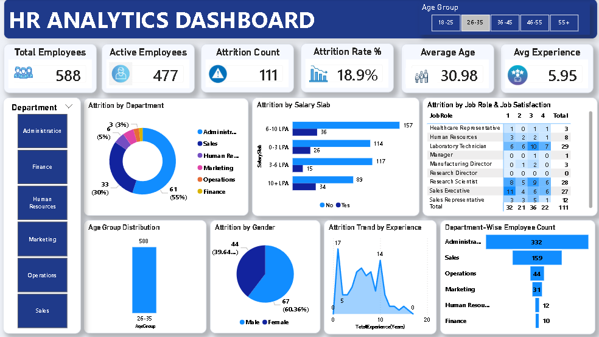
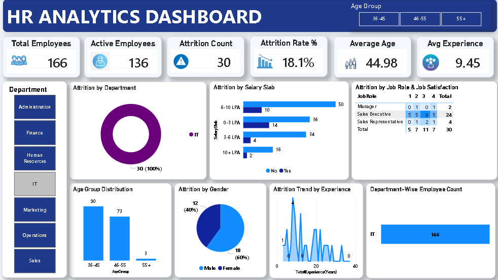
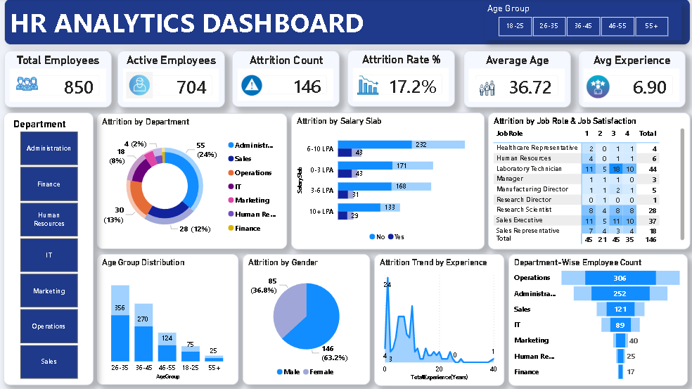

# 👥 HR Analytics Dashboard

## Project Overview

This Power BI HR Analytics Dashboard provides insights into employee demographics, attrition trends, department performance, and workforce analytics.

## Key Features

- Employee Count Analysis
- Active Employee Tracking
- Attrition Analysis
- Attrition Rate Monitoring
- Department-wise Insights
- Age Group Analysis
- Salary Slab Analysis
- Gender-wise Attrition Analysis
- Job Satisfaction Analysis

## Tools Used

- Power BI
- Power Query
- DAX
- Excel

## Dashboard Preview

## Files Included

- HR_Analytics_Dashboard.pbix
- HR_Analytics_Dashboard.mp4
- Dashboard Screenshots

## Skills Demonstrated

- Data Cleaning
- Data Modeling
- DAX Calculations
- Workforce Analytics
- Dashboard Design
- Data Visualization

## Business Insights

- The highest attrition was observed in specific departments.
- Employees with lower salaries showed higher attrition rates.
- The 26–35 age group formed the largest employee segment.
- Job satisfaction levels impacted employee retention.
- Certain departments contributed significantly to overall attrition.
